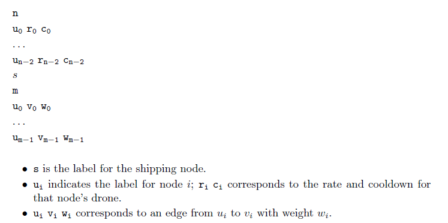

# drone-delivery-path
Using dynamic programming on an acyclic graph to determine an optimal path.

The scenario:
A package needs to be delivered by drone from a "source" zone to a "target" zone. There is a set of zones, with specified paths that drones may take. Each zone has its own drone, with its own speed and cooldown time. Upon reaching each zone, the drone must cooldown. At this point, there is a choice to continue with the same drone, or switch to the drone of the current zone. The task to the find the combination of drones and paths which minimise the delivery time.

Input:  

Output:  
For every node "u", the cost of the optimal delivery path from "u" to "s".  

Example input (n10_0.in):  
> 10  
1 1.6466 1.1243  
2 8.9333 33.0609  
3 8.1580 0.0111  
4 13.5427 12.9451  
5 0.0780 9.1671  
6 2.5950 26.2759  
7 6.3969 6.0146  
8 3.2799 20.4559  
9 3.8143 23.6384  
0  
18  
5 0 20.795  
8 0 2.1966  
8 1 25.5227  
8 4 6.2382  
8 5 3.1897  
8 7 57.741  
9 0 6.4224  
2 1 50.7682  
2 0 3.1153  
1 0 10.1469  
6 1 45.8888  
6 0 0.0957  
3 2 10.8033  
3 0 0.3008  
7 3 11.3411  
7 4 5.5619  
7 0 34.4385  
4 0 11.0791  

Example output (n10_0.out):  
> 17.83  
60.89  
2.47  
162.99  
10.79  
26.52  
81.03  
27.66  
48.14  
